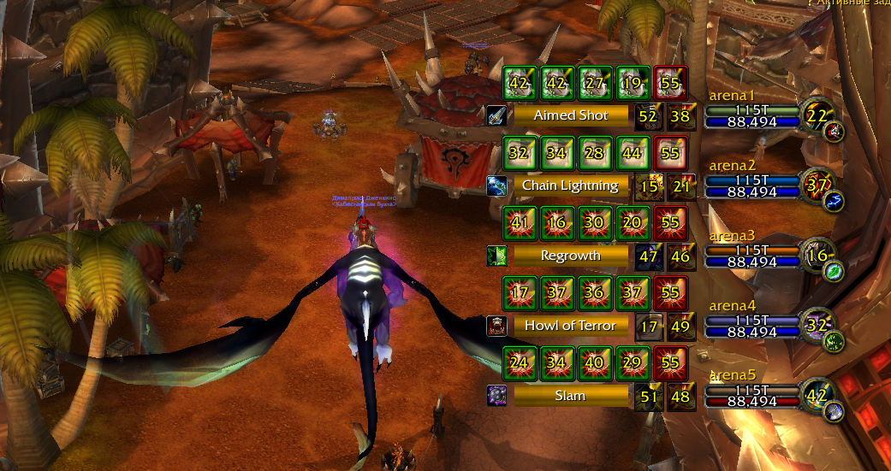
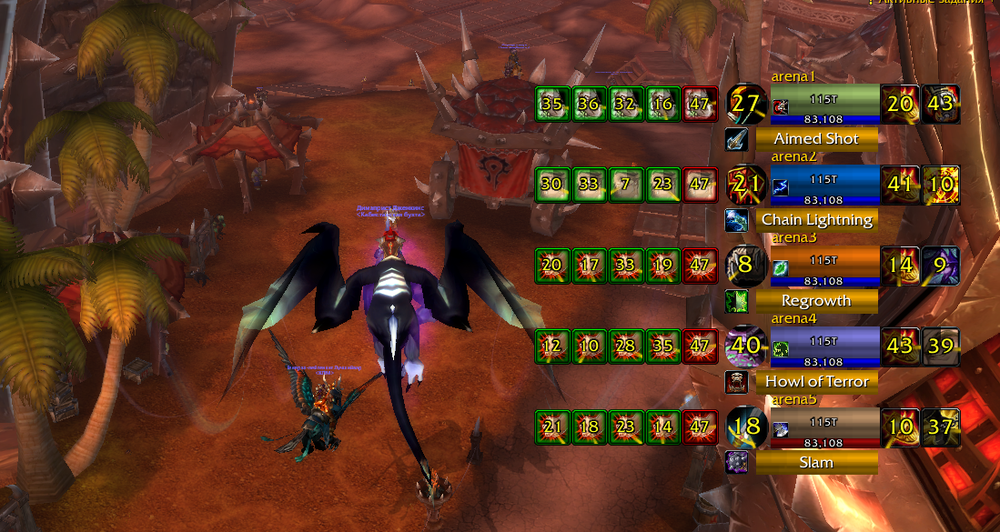

# Enhanced Arena Frames

  

Arena frames in standard Blizzard design with additional information. 

Fork of an addon [sArena](https://github.com/stako/sArena) ([stako](https://github.com/stako)).

## Features

- Trinket & Racial Tracker
- DR Tracker
- See important buffs & debuffs
- See interrupt lockouts
- Multiple layouts
- Enemy specialization detections

## Quick Start

Type ``/sarena`` for open addon options.

Ctrl+Shift+Click to drag stuff.

## sArena Layouts

### Xaryu

## Support

If you found are bugs please use Issues or Pull request your fixes.